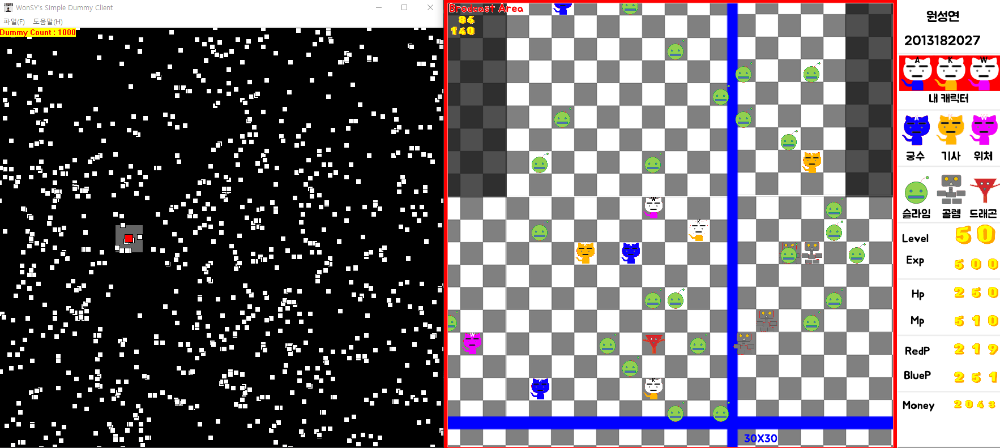

# dummy-client-framework
GameServer Dummy Client Framework For TCP/IP Socket Server

현재 작업중인 저장소로, 기능적인 측면에서 더미클라언트는 정상 동작하며 빌드에는 이상없으나, 
내부 코드 중 일부 함수들(LogManager, PerformanceManager)이 미동작합니다.

감사합니다.

#### History
 190910
  - 기능 문제 수정 완료
  - 렌더, 로그, 퍼포먼스 매니 추가 작업 필요

Thanks :)
  - [강수빈](https://github.com/Lyricia)
